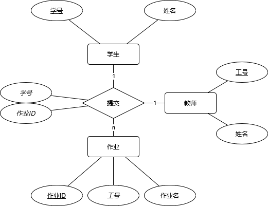

# 学委作业收集管理系统课程设计报告

## 需求分析

在教学过程中，组长、学委、老师时常需要收集同学们的作业。但是不同教师对作业的文件命名有自己的要求。同学们总会在作业的文件命名上出一些小错误。如果由收集者人工校对每一个文件名，无疑是十分浪费时间的。这一过程过分重复且枯燥。而计算机恰好很擅长实现大批量的重复任务。因此，通过编程，为自动化检测作业提交情况，检测文件命名是否合规并重命名不规范的文件是很有必要的。

## 概念结构设计

首先明确，每个班级有不同的课程要上，而教师也需要上不同的课程。每节课还有多份不同的作业需要提交，因此需要设计一个三元关系来处理作业的提交情况。

## E-R图
下划线代表主键，斜体字代表外键  
### 局部ER图
**学生表**


**教师表**


**布置表**


**收集表**


### 全局ER图


## 数据库设计

### 逻辑结构设计
#### E-R模型向关系模式的转换
学生关系模式（<u>学生学号</u>, 学生姓名）

教师关系模式（<u>教师工号</u>, 教师姓名）

作业关系模式（<u>作业id</u>, *教师工号*, 作业标题）

提交关系模式（*学生学号*, *作业id*）
#### 实体关系设计
1. 学生和作业之间是一对多关系，每个学生需要交多份作业
2. 教师和作业之间是一对多关系，每个教师可能需要布置多份作业


### 物理设计
**学生students表**
| 列明         | 描述     | 数据类型    | 允许空值 | 说明 |
| ------------ | -------- | ----------- | -------- | ---- |
| student_id   | 学生学号 | VARCHAR(50) | NOT NULL | 主键 |
| student_name | 学生姓名 | VARCHAR(50) | NOT NULL |      |

**教师teachers表**
| 列明         | 描述     | 数据类型    | 允许空值 | 说明 |
| ------------ | -------- | ----------- | -------- | ---- |
| teacher_id   | 教师工号 | VARCHAR(50) | NOT NULL | 主键 |
| teacher_name | 教师姓名 | VARCHAR(50) | NOT NULL |      |

**作业assignments表**
| 列明            | 描述     | 数据类型    | 允许空值 | 说明 |
| --------------- | -------- | ----------- | -------- | ---- |
| assignment_id   | 作业编号 | VARCHAR(50) | NOT NULL | 主键 |
| teacher_id      | 教师工号 | VARCHAR(50) | NOT NULL | 外键 |
| assignment_name | 作业标题 | VARCHAR(50) | NOT NULL |      |

**提交submits表**
| 列明          | 描述     | 数据类型    | 允许空值 | 说明 |
| ------------- | -------- | ----------- | -------- | ---- |
| student_id    | 学生学号 | VARCHAR(50) | NOT NULL | 外键 |
| assignment_id | 作业编号 | VARCHAR(50) | NOT NULL | 外键 |


## 数据库实施

### 建立基本表
建表sql代码如下

**学生students表**
```sql
-- 创建学生表
CREATE TABLE students (
    student_id VARCHAR(50) PRIMARY KEY,
    student_name VARCHAR(50) NOT NULL
);
```

**教师teachers表**
```sql
-- 创建教师表
CREATE TABLE teachers (
    teacher_id VARCHAR(50) PRIMARY KEY,
    teacher_name VARCHAR(50) NOT NULL
);

```

**作业assignments表**

```sql
-- 创建作业布置表
CREATE TABLE assignments (
    assignment_id VARCHAR(50) PRIMARY KEY,
    teacher_id VARCHAR(50) NOT NULL,
    assignment_name VARCHAR(50) NOT NULL,
    FOREIGN KEY (teacher_id) REFERENCES teachers(teacher_id) ON UPDATE CASCADE ON DELETE NO ACTION
);
```

**提交submits表**
```sql

-- 创建作业统计表
CREATE TABLE submits (
    student_id VARCHAR(50) NOT NULL,
    assignment_id VARCHAR(50) NOT NULL,
    FOREIGN KEY (assignment_id) REFERENCES assignment(assignment_id) ON UPDATE CASCADE ON DELETE NO ACTION,
    FOREIGN KEY (student_id) REFERENCES students(student_id) ON UPDATE CASCADE ON DELETE NO ACTION
);

```

### 插入数据
可以使用插入语句插入数据到目标表格。
```sql
INSERT INTO students (student_id, student_name)
VALUES 
    ('202412340101', '坤一'),
    ('202412340102', '熊二'),
    ('202412340103', '张三'),
    ('202412340104', '李四'),
    ('202412340105', '王五'),
    ('202412340106', '赵六'),
    ('202412340107', '孙七'),
    ('202412340108', '周八'),
    ('202412340109', '吴九'),
    ('202412340110', '郑十');

INSERT INTO teachers (teacher_id, teacher_name)
VALUES 
    ('t2024001', '罗翔'),
    ('t2024002', '蔡徐坤'),
    ('t2024003', '派蒙'),
    ('t2024004', '温迪'),
    ('t2024005', '钟离'),
    ('t2024006', '雷电影'),
    ('t2024007', '纳西妲'),
    ('t2024008', '芙宁娜'),
    ('t2024009', '刘伟'),
    ('t2024010', '库克');


INSERT INTO assignments (assignment_id, teacher_id, assignment_name)
VALUES 
    ('FA20240601', 't2024001', '危险的想法与刑法'),
    ('FA20240602', 't2024001', '法外狂徒与完整的刑法'),
    ('EXP20240601', 't2024002', '铁山靠基本动作与衍生舞蹈'),
    ('YS20240101', 't2024003', '必修1高等元素论'),
    ('YS20240102', 't2024003', '必修2普通破盾学'),
    ('YS20240103', 't2024003', '必修3伤害乘区论'),
    ('YS20240104', 't2024003', '必修4韧性力学'),
    ('YS20240105', 't2024003', '必修5反应详解'),
    ('YS20240106', 't2024003', '抽卡时的心态管理'),
    ('LC20240106', 't2024010', '只有苹果才能做到');


INSERT INTO submits (student_id, assignment_id)
VALUES 
    ('202412340103', 'FA20240601'),
    ('202412340104', 'FA20240601'),
    ('202412340103', 'FA20240602'),
    ('202412340101', 'YS20240106'),
    ('202412340102', 'YS20240106'),
    ('202412340104', 'YS20240106'),
    ('202412340105', 'YS20240106'),
    ('202412340106', 'YS20240106'),
    ('202412340107', 'YS20240106'),
    ('202412340108', 'YS20240106');

```
直接修改sql语句进行插入对于非程序员用户较为复杂，因此提供另一种更为简单的方法，程序支持使用表格导入，只需要将需要插入的数据按照字段名在Excel中列出，选择保存或者另存为，注意格式选择`CSV UTF-8(逗号分隔)(*.csv)`，保存后的文件可以用记事本打开检查格式，csv表格应该类似下面这样
```csv
student_id,student_name
202412340101,坤一
202412340102,熊二
202412340103,张三
202412340104,李四
202412340105,王五
202412340106,赵六
202412340107,孙七
202412340108,周八
202412340109,吴九
202412340110,郑十

teacher_id,teacher_name
t2024001,罗翔
t2024002,蔡徐坤
t2024003,派蒙
t2024004,温迪
t2024005,钟离
t2024006,雷电影
t2024007,纳西妲
t2024008,芙宁娜
t2024009,刘伟
t2024010,库克

assignment_id,teacher_id,assignment_name
FA20240601,t2024001,危险的想法与刑法
FA20240602,t2024001,法外狂徒与完整的刑法
EXP20240601,t2024002,铁山靠基本动作与衍生舞蹈
YS20240101,t2024003,必修1高等元素论
YS20240102,t2024003,必修2普通破盾学
YS20240103,t2024003,必修3伤害乘区论
YS20240104,t2024003,必修4韧性力学
YS20240105,t2024003,必修5反应详解
YS20240106,t2024003,抽卡时的心态管理
LC20240106,t2024010,只有苹果才能做到

student_id,assignment_id
202412340103,FA20240601
202412340104,FA20240601
202412340103,FA20240602
202412340101,YS20240106
202412340102,YS20240106
202412340104,YS20240106
202412340105,YS20240106
202412340106,YS20240106
202412340107,YS20240106
202412340108,YS20240106

```
csv表格因其格式简单，是常见的跨软件导入导出时使用的表格文件，本程序中使用Python的csv标准库进行数据读写，相关方法已集成在`dao.py`的`Database`类中。以下展示部分核心部分代码。
```python
import csv
import sqlite3


class Database():

    # 参考了cs50包含从句的query语句构建教程
    # https://cs50.readthedocs.io/libraries/cs50/python/#how-can-i-add-optional-clauses-to-a-query
    def make_insert(self, table, field):
        '''构建插入语句，需要输入目标表，字段名，会检验字段名、表名是否合法，但是不会检测字段名是否应该出现在表中,由执行函数捕捉错误进行异常处理'''
        # 检查表是否合法
        if table not in self.valid_table:
            raise ValueError("表名有误")
        query = "INSERT INTO " + table
        clauses = []
        values = []
        for i in field:
            if i in self.valid_field:
                clauses.append("?")
                values.append(i)
            else:
                raise ValueError("字段名有误")
        if clauses:
            query = query + " (" + ", ".join(field) + ") VALUES (" + ", ".join(clauses) + ")"
        return query

    # 构建查询语句
    def import_csv(self, csvfile, table):
        '''导入表格，需要负责异常捕捉'''
        # 清空表格
        self.cur.execute("DELETE FROM " + table)
        try:
            # 打开csv文件
            with open(csvfile, 'r', encoding='utf-8') as f:
                reader = csv.reader(f)
                # 读取字段
                field = next(reader)
                for row in reader:
                    # 构建查询语句并执行
                    query = self.make_insert(table, field)
                    self.cur.execute(query,row)
                # 提交事务
                self.con.commit()
        # 捕捉异常，例如找不到字段无法插入等。
        except:
            print("出错了")
```
本程序编写时已经考虑到了防范SQL注入，提前在`__init__()`方法中初始化了合法字段名与表名，用户的插入的字段名和表名都需要经过合法性检验的消毒，同时在构建插入语句的时候使用`qmark`风格传参，`qmark`风格传参使用的是DB-api，由SQLite进行用户输入消毒。综上措施，可以最大程度避免SQL注入攻击。

### 建立游标

Python中使用sqlite3库函数，通过sqlite3.connect().cursor()方法建立游标。游标可以执行SQLite的SQL语句。本程序中已经集成在`dao.py`中，导入并实例化后可以直接以`db.cur`的方式调用要游标。
```python
import sqlite3

class Database():

    def __init__(self, target_db = "database.db"):
        # 获取项目的根目录，以及其他高频的相对路径
        self.root_path = os.path.dirname(os.path.dirname(os.path.abspath(__file__)))
        self.data_path = os.path.join(self.root_path, "data")
        self.db_path = os.path.join(self.data_path, target_db)

        # 连接数据库
        self.con = sqlite3.connect(self.db_path)
        self.cur = self.con.cursor()
```


### 建立索引

submits表建立aid和sid的索引
```sql
CREATE INDEX idx_submits_assignment_id ON submits (assignment_id);
CREATE INDEX idx_submits_student_id ON submits (student_id);
```
assignments表建立工号第一排序，aid第二排序。
```sql
CREATE INDEX idx_assignments_tid_aid ON assignments (teacher_id, assignment_id);

```
### 创建视图
学生姓名和教师姓名
```sql
CREATE VIEW student_teacher_view AS
SELECT s.student_name, t.teacher_name
FROM students s
JOIN submits sb ON s.student_id = sb.student_id
JOIN assignments a ON sb.assignment_id = a.assignment_id
JOIN teachers t ON a.teacher_id = t.teacher_id;

```
姓名和作业名
```sql
CREATE VIEW name_assignment_view AS
SELECT s.student_name, a.assignment_name
FROM students s
JOIN submits sb ON s.student_id = sb.student_id
JOIN assignments a ON sb.assignment_id = a.assignment_id;
```

### 多种查询
#### 简单查询
所有学生
```sql
SELECT * FROM students
```
#### 复合查询
学生已提交的作业
```sql
SELECT s.student_name, a.assignment_name
FROM students s
JOIN submits sb ON s.student_id = sb.student_id
JOIN assignments a ON sb.assignment_id = a.assignment_id;
```
未交作业的学生
```sql
SELECT s.student_name
FROM students s
WHERE s.student_id NOT IN (SELECT student_id FROM submits);
```
#### 跨表查询
学号和教师工号
```sql
SELECT s.student_id, t.teacher_id
FROM students s
JOIN submits sb ON s.student_id = sb.student_id
JOIN assignments a ON sb.assignment_id = a.assignment_id
JOIN teachers t ON a.teacher_id = t.teacher_id;
```
## 运行维护计划
SQLite数据库较为简单，可以直接复制`database.db`文件到目标位置实现备份，也可以使用git进行版本管理。

除此之外也可以在在SQLite cli中导出所有数据到sql脚本，导出代码如下。
```bash
sqlite3 your_database.db ".dump" > all_data.sql
```
## 总结
本次课程设计，实现了对学生提交的作业进行管理、对不规范的文件名进行批量重命名。

体现了Python和SQLite的灵活与强大。Python是一个非常强大的编程语言。绝大部分常见的需求都可以在其中找到库，并使用相关函数和方法除了作为控制层，后期还可以与Flask框架结合作为后端，与网页交互。SQLite作为一个轻量级数据库，具有强大的灵活性，特别适合这类作为单用户单程序的数据库，是写入txt文件的强力替代品。相比与MySQL、SQL Server等重型数据库动辄几GB的硬盘占用，SQLite去除了多用户同时读写的支持，无法供多个用户同时读写，但也因此将程序的体积将至令人难以置信的10MB以内的程度，占据了绝大部分嵌入式数据库的市场份额，也是安卓、Python等操作系统和编程语言内嵌的数据库，无需额外下载安装。

本程序存在问题是尚未完成前端界面的编写,测试用例尚未从非法使用的方向进行测试。同时暂时不支持用户以人机交互的形式输入合法字段名、表名，以及设置的自定义。这类修改还需要深入代码进行修改。

展望未来，本程序可以完成前端界面的编写，以网页的形式与用户交互，并与electron、uniapp等网页软件打包框架结合并分发软件，以支持在Windows、MacOS、Linux、安卓、iOS、小程序、网页等多平台的跨平台使用需求。以后可以学习GitHub action等新技术，进行CI/CD（持续集成和持续交付）的组合实践。达到在本地推送代码到GitHub仓库后被GitHub action自动编译并分发release，同时被其他已存在的客户端检测到版本更新。
